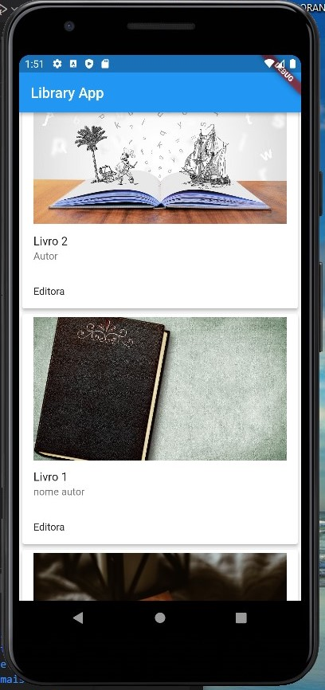

# Aplicativo de biblioteca
## Tecnologias:
 1- FRONTEND: Flutter.  
 2- BACKEND: Django RestFramework , SQLite.
## Aplicativo feito em flutter, utilizando uma API feita com Django RestFramework. 
 

